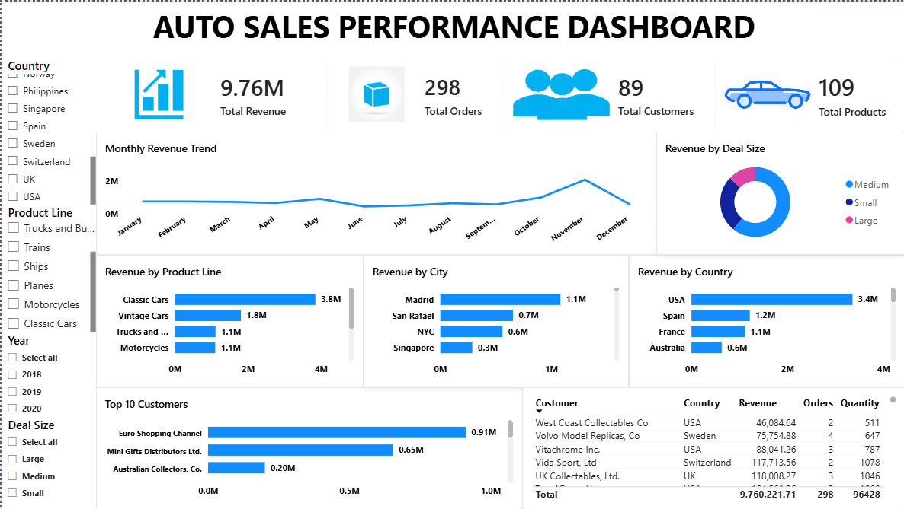
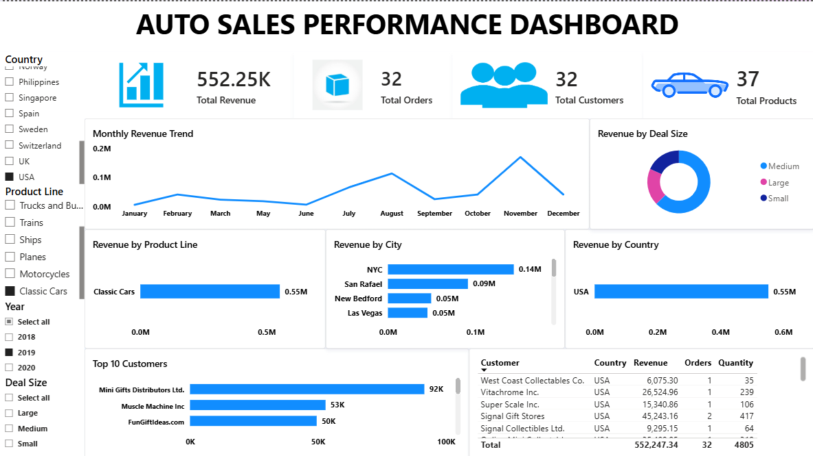

# 🚗 Auto Sales Performance Analysis

An end-to-end Data Analytics project that transforms raw auto sales data into actionable business insights using **Microsoft Excel, MySQL, and Power BI**. The project demonstrates the complete analytics workflow, including data cleaning, dimensional modeling, SQL analysis, and interactive dashboard development.

## 📖 Project Overview

This project analyzes historical auto sales data to uncover sales trends, customer purchasing behavior, and product performance.

The project follows a complete end-to-end data analytics workflow:

- Cleaned and prepared raw data using Microsoft Excel
- Built a dimensional data warehouse in MySQL
- Performed Exploratory Data Analysis (EDA) using SQL
- Designed an interactive Power BI dashboard to visualize key business metrics


## 🎯 Business Problem

The business wants to understand:

- Which product lines generate the highest revenue?
- Which countries and cities contribute the most sales?
- Who are the highest-value customers?
- How does revenue change over time?
- What deal sizes contribute the most revenue?

The goal is to provide actionable insights that support sales and business decision-making.

## 🛠 Tools & Technologies

| Tool | Purpose |
|------|---------|
| Microsoft Excel | Data Cleaning |
| MySQL | Data Warehouse & SQL Analysis |
| Power BI | Dashboard & Visualization |
| GitHub | Project Documentation |

## 🔄 Analytics Workflow

```text
Raw Dataset
     │
     ▼
Microsoft Excel
(Data Cleaning)
     │
     ▼
MySQL
(Data Warehouse + SQL EDA)
     │
     ▼
Power BI
(Interactive Dashboard)
```

## 📂 Project Structure

```text
Auto-Sales-Analysis/
│
├── Dataset/
├── Excel/
├── SQL/
├── PowerBI/
├── Images/
└── README.md
```
## 📊 Power BI Dashboard

The interactive Power BI dashboard provides an executive overview of auto sales performance, customer behavior, product performance, and geographic sales distribution.

### Dashboard Overview



### Dashboard with Filters Applied (USA)

The dashboard below demonstrates the interactive filtering capabilities by selecting **USA**.



## 📈 Key Business Insights

- 🚗 Classic Cars generated the highest revenue among all product lines.
- 🌍 The USA contributed the largest share of total sales revenue.
- 📅 Sales peaked in November, indicating strong seasonal demand.
- 🤝 Medium-sized deals accounted for the largest portion of revenue.
- 🏆 Euro Shopping Channel was the highest revenue-generating customer.

  ## 💡 Business Recommendations

- Increase marketing efforts for high-performing product lines such as Classic Cars.
- Focus on expanding sales strategies in top-performing countries like the USA.
- Prepare inventory and promotional campaigns ahead of peak sales months.
- Strengthen relationships with high-value customers through loyalty programs.
- Investigate opportunities to increase the number of medium and large deal-size transactions.

  ## 🗄️ SQL Skills Demonstrated

- Database creation and table design
- Star schema implementation
- Primary and foreign key relationships
- Data cleaning and transformation
- SQL Joins
- Aggregate Functions
- Common Table Expressions (CTEs)
- Window Functions (Running Total & Ranking)
- Views
- Exploratory Data Analysis (EDA)

## 📊 Power BI Features

- Interactive KPI Cards
- Slicers for dynamic filtering
- Report Page Tooltips
- Date Table
- DAX Measures
- Star Schema Data Model
- Interactive Bar, Line, and Donut Charts

## 👤 Author

**Victoria Kosgei**

Aspiring Data Analyst with hands-on experience in Excel, SQL, Power BI, and Tableau. Passionate about transforming raw data into actionable business insights through data cleaning, analysis, visualization, and interactive dashboards.

### Connect with Me

- 💼 LinkedIn: [Victoria Kosgei](https://www.linkedin.com/in/victoria-kosgei-886582295/)
- 💻 GitHub: [Victoria-9675](https://github.com/Victoria-9675)


